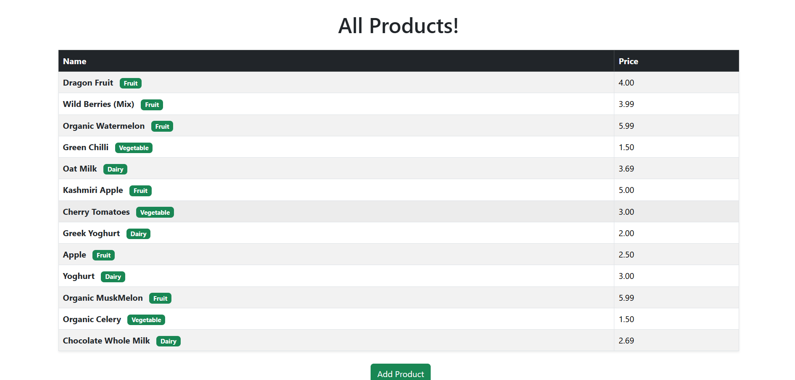
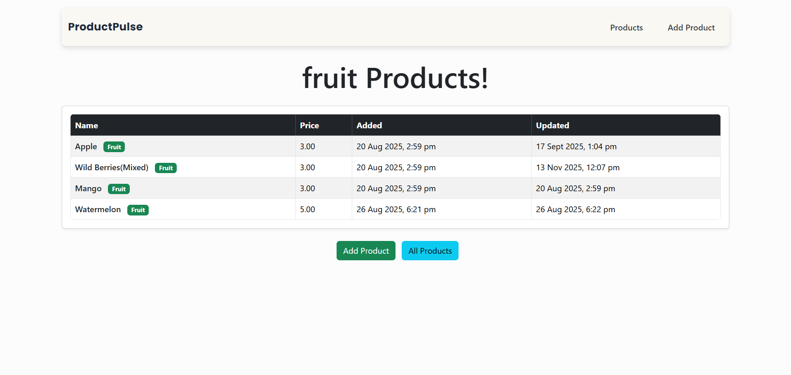
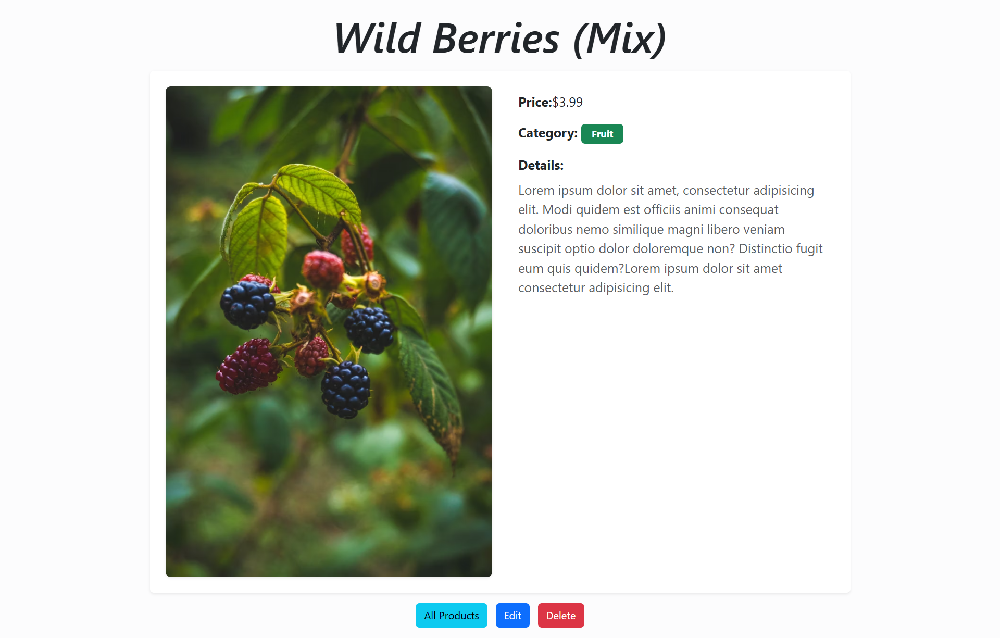
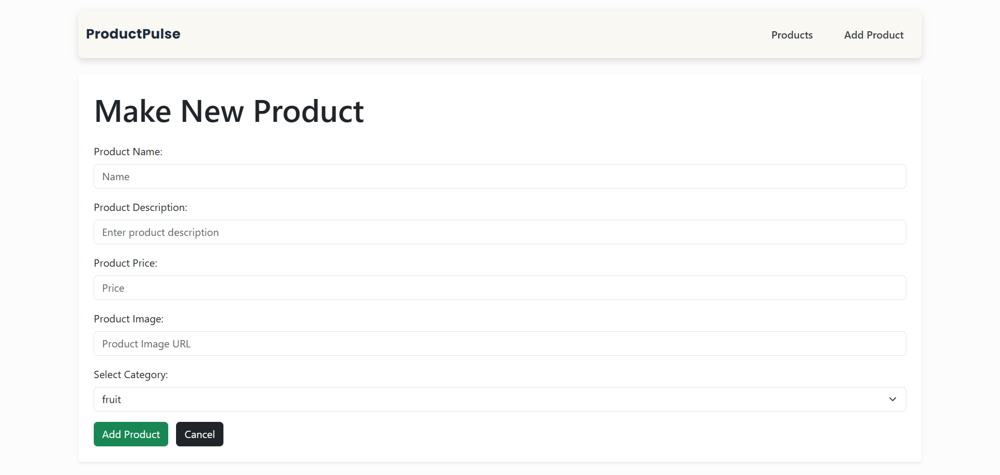
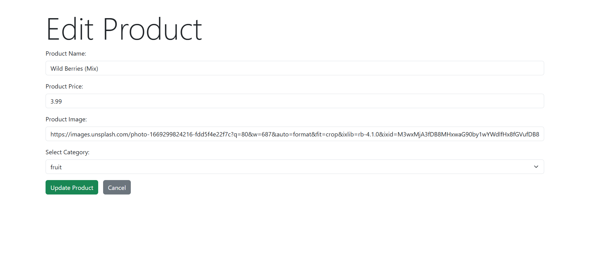

# ProductPulse

A simple CRUD web application demonstrating the basics of using **Mongoose** with **MongoDB** and **Express** in **Node.js**.  
This project allows you to create, read, update, and delete products, and filter them by category, all with a clean EJS-based UI.

---

## Features

- View all products in a table
- Filter products by category
- Add new products
- Edit existing products
- Delete products
- Clean, responsive UI with EJS and custom CSS

---

## Screenshots

### All Products


### Filtered by Category


### Product Details


### Add Product


### Edit Product


---

## Technologies Used

- Node.js
- Express
- MongoDB
- Mongoose
- EJS
- Bootstrap

---

## Getting Started

### 1. Install Dependencies

```bash
npm install
```

### 2. Start MongoDB

Make sure your MongoDB server is running locally.  
If you have MongoDB installed, you can start it with:

```bash
mongosh
```

### 3. Seed the Database (Optional)

To populate your DataBase with sample products, run:

```bash
node seeds.js
```

### 4. Start the Server

```bash
nodemon index.js
```

The app will be available at [http://localhost:3000/products](http://localhost:3000/products).

---

## Usage

- **View all products:**  
  Go to `/products` to see the product list.
- **Filter by category:**  
  Use the category filter as needed.
- **Add a product:**  
  Click "Add Product" and fill out the form.
- **Edit or delete a product:**  
  Click a product name, then use the "Edit" or "Delete" options.

--- 

## Project Structure

- `index.js` – Main Express application; sets up routes, connects to MongoDB, and starts the server.
- `models/product.js` – Defines the Product schema and model using Mongoose.
- `seeds.js` – Script to populate the database with sample product data.
- `views/products/index.ejs` – Displays the list of products.
- `views/products/details.ejs` – Shows details for a single product.
- `views/products/edit.ejs` – Form to edit an existing product.
- `views/products/new.ejs` – Form to add a new product.

--- 

## Feedback ⭐️
If you like this project, consider starring the repo to show your support!

---

## License
This project is licensed under the MIT License - see the [LICENSE](LICENSE) file for details.
