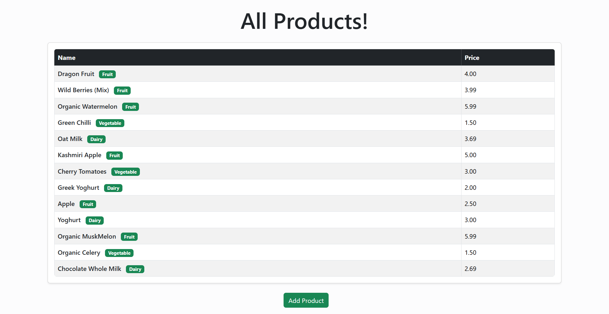
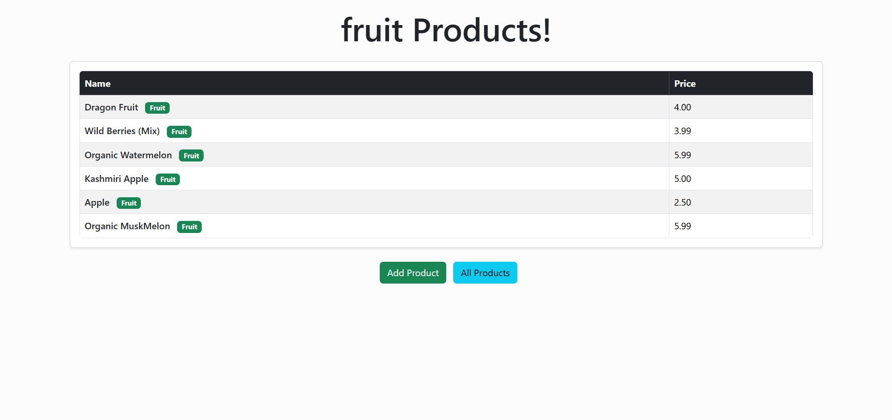
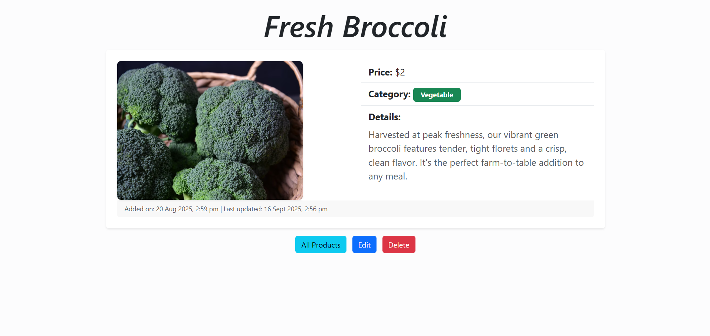
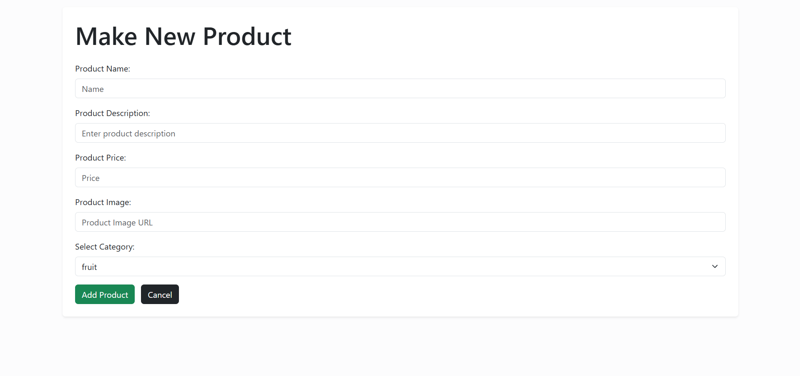

# 🛒 ProductPulse

A simple CRUD web application demonstrating the basics of using **Mongoose** with **MongoDB** and **Express** in **Node.js**.  
This project allows you to create, read, update, and delete products, and filter them by category, all with a clean EJS-based UI.

---

## Features

- View all products in a table
- Filter products by category
- Add new products
- Edit existing products
- Delete products
- Clean, responsive UI with EJS and custom CSS

---

## Routes & App Flow

- **GET** `/products` – View all products
- **GET** `/products/new` – Open the form to add a new product
- **GET** `/products/:id` – View product details
- **GET** `/products/:id/edit` – Edit an existing product
- **DELETE** `/products/:id` – Delete a product (via form submission)

---

## Screenshots

### All Products


### Filtered by Category


### Product Details


### Add Product


### Edit Product


---

## Technologies Used

- Node.js
- Express
- MongoDB
- Mongoose
- EJS
- Bootstrap

---

## Getting Started

### 1. Install Dependencies

```bash
npm install
```

### 2. Start MongoDB

Make sure your MongoDB server is running locally.  
If you have MongoDB installed, you can start it with:

```bash
mongosh
```

### 3. Seed the Database (Optional)

To populate your database with sample products, run:

```bash
node seeds.js
```

### 4. Start the Server

```bash
nodemon index.js
```

The app will be available at [http://localhost:3000/products](http://localhost:3000/products).

--- 

## Project Structure

- `index.js` – Main Express app; sets up routes, connects to MongoDB, and starts the server.
- `models/product.js` – Mongoose schema and model definition
- `seeds.js` – Script to seed the database with sample products
- `views/products/index.ejs` – Displays the list of products.
- `views/products/details.ejs` – Shows individual product details
- `views/products/edit.ejs` – Form to edit an existing product.
- `views/products/new.ejs` – Form to add a product.

--- 

## Feedback ⭐️
If you like this project, consider starring the repo to show your support!

---

## License
This project is licensed under the MIT License - see the [LICENSE](LICENSE) file for details.
