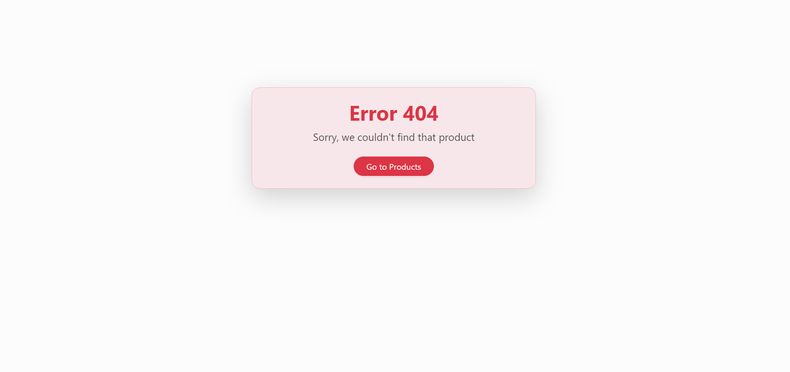

# 🛒 ProductPulse

A full-stack, catalog-style CRUD application for managing and browsing products by category — built with Node.js, Express, MongoDB, Mongoose, and EJS.

---

## Features

- View all products in a table
- Filter products by category
- Add new products (with name, price, image, category, and description)  
- Edit existing products
- Delete products
- Product details page now shows **creation and last updated timestamps**
- Clean, responsive UI with EJS and Bootstrap 5
- Robust error handling for validation errors, invalid ObjectIds, and missing resources — all errors are shown on a custom, responsive error page for a better user experience.

---

## Routes & App Flow

- **GET** `/products` – View all products
- **GET** `/products/new` – Open the form to add a new product
- **GET** `/products/:id` – View product details
- **GET** `/products/:id/edit` – Edit an existing product
- **DELETE** `/products/:id` – Delete a product (via form submission)
- **ERROR** `/products/:invalidID` – Displays a user-friendly error message for invalid requests or missing resources

---

## Preview

### All Products


### Filtered by Category


### Product Details


### Add Product


### Edit Product


### Product Not Found (Error Handling)
Attempting to access a valid but non-existent product ID:


---

## Technologies Used

- Node.js
- Express
- MongoDB
- Mongoose
- EJS
- Bootstrap

---

## Getting Started

### 1. Install Dependencies
```bash
npm install
```

### 2. Start MongoDB (if not running automatically)
MongoDB must be running for the app to work. If it’s not running automatically, start it manually:
```bash
mongod
```

### 3. Seed the Database (Optional)
To populate your database with sample products, run:
```bash
node seeds.js
```
> This will clear any existing products and insert fresh seed data.

### 4. Start the Server
```bash
nodemon index.js
```
> If you don’t have nodemon installed globally, you can install it with `npm install -g nodemon`,
or simply run `node index.js` instead.
> To stop the server, press Ctrl + C in the terminal.

The app will be available at [http://localhost:3000/products](http://localhost:3000/products).

--- 

## Project Structure

- `index.js` – Main Express app; sets up middleware, connects to MongoDB, mounts routers, and starts the server.
- `routes/products.js` – Router module containing all product-related routes.
- `models/product.js` – Mongoose schema and model definition.
- `seeds.js` – Script to seed the database with sample products.
- `views/products/index.ejs` – Displays the list of products.
- `views/products/details.ejs` – Shows individual product details.
- `views/products/edit.ejs` – Form to edit an existing product.
- `views/products/new.ejs` – Form to add a product.
- `wrapAsync.js` – Utility to catch async errors cleanly.
- `appError.js` – Custom error class for structured error responses.
- `validateObjId.js` – Middleware to handle invalid ObjectId formats.
- `views/error.ejs` – Styled error page for displaying validation errors, invalid ObjectIds, etc.

--- 

## Contributing

Contributions, issues, and suggestions are welcome!  
Please read the [Contributing Guidelines](./CONTRIBUTING.md) before making changes.

---

## Feedback

If you like this project, consider starring the repo to show your support!

---

## License

This project is licensed under the MIT License - see the [LICENSE](LICENSE) file for details.
